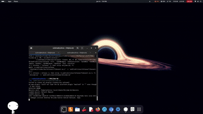
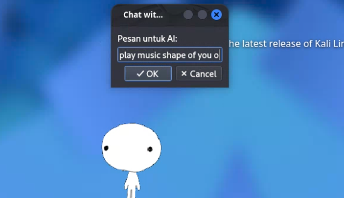
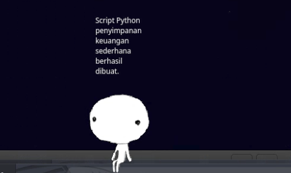
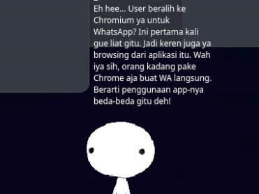

# Lumina AI

> A local AI desktop companion with memory, tools, and desktop awareness.

<p align="center">
  
</p>

<p align="center">
Powered by local LLMs. No cloud APIs required.
</p>


Lumina AI is an AI-powered desktop companion built with native C++ and Qt6 on top of the Shijima framework. Unlike traditional desktop mascots, Lumina can remember conversations, browse the web, manipulate files, execute commands, monitor active windows, and interact with the user's desktop environment through a persistent animated companion powered by local language models.

## Current Capabilities

* Chat with local LLMs through Ollama
* Maintain conversation memory
* Search, read, create, and modify files
* Execute shell commands
* Browse websites and retrieve information
* Detect and react to active windows
* Expose functionality through HTTP APIs
* Display dynamic mascot expressions and behaviors

## Features

* Native C++ / Qt6 architecture
* Local LLM integration through Ollama
* Persistent memory subsystem
* Desktop awareness framework
* HTTP API integration
* Extensible tool architecture
* Animated mascot engine
* Linux desktop support

## Why Lumina?

Most desktop mascots are purely cosmetic.

Lumina combines an animated desktop companion with AI agent capabilities, allowing it to understand context, remember information, interact with files, browse the web, execute commands, and respond to the user's desktop activity.

## Goals

Lumina AI aims to bridge the gap between traditional desktop mascots and modern AI assistants by combining an interactive animated companion with practical desktop automation and AI capabilities.

## Technology Stack

* C++
* Qt6
* Ollama
* Local Large Language Models (LLMs)
* HTTP-based Tool System
* Shijima Framework

## Ollama Setup

Lumina AI requires a local Ollama instance and at least one compatible language model.
> ⚠️ Current releases are tested with `qwen2.5:3b` running through Ollama.

### Install Ollama

```bash
curl -fsSL https://ollama.com/install.sh | sh
```

Verify installation:

```bash
ollama --version
```

### Download a Model

Lumina AI is currently configured and tested with:

```bash
ollama pull qwen2.5:3b
```

You can verify the model is installed:

```bash
ollama list
```

### Start Ollama

```bash
sudo systemctl start ollama
```

Or run manually:

```bash
ollama serve
```

Make sure the Ollama API is accessible at:

```text
http://localhost:11434
```


## Requirements

- Linux (tested on Debian-based distributions)
- Qt6 Development Libraries
- C++ Compiler with C++17 support
- Ollama
- qwen2.5:3b model

## Installation

```bash
# Clone repository
git clone https://github.com/Lumina403/Lumina-AI.git
cd Lumina-AI

# Ensure Ollama is running
sudo systemctl start ollama

# Build
CONFIG=release make -j$(nproc)

# Run
./build/LuminaAI
```
## Screenshots

### Chat Interface


### File Operations


### Desktop Awareness


## Credits

Lumina AI is built on top of the Shijima-Qt framework and extends it with AI-powered desktop interaction, memory systems, tool execution, automation, web browsing, and local LLM integration.

Special thanks to the original Shijima-Qt and libshimejifinder contributors for providing the foundation that made this project possible.

AI architecture, agent systems, integrations, and additional functionality developed by Azkiah Darojah.

## License

Lumina AI is licensed under the GNU General Public License v3.0 (GPL-3.0).

As Lumina AI incorporates and extends GPL-licensed software from the Shijima-Qt ecosystem, all redistributed versions and derivative works must comply with the GPL-3.0 license terms.

## Project Status

Lumina AI is currently under active development. Features, APIs, and agent capabilities may change between releases.

## Roadmap
- [x] Local LLM integration
- [x] Memory system
- [x] File operations
- [x] Desktop awareness
- [x] Command execution
- [x] Web browsing
- [ ] Multi-model support
- [ ] Voice interaction
- [ ] Improved agent autonomy
- [ ] Additional desktop integrations

## Architecture

Lumina AI consists of three primary layers:

- Mascot Layer (Shijima-based rendering and interactions)
- Agent Layer (memory, reasoning, and tool orchestration)
- Integration Layer (file operations, web access, command execution, and desktop awareness)

All AI inference is performed locally through Ollama-compatible language models.
