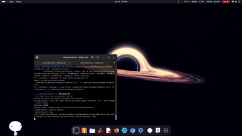
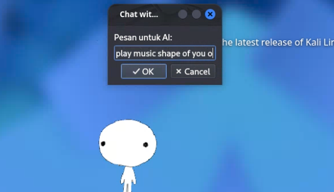
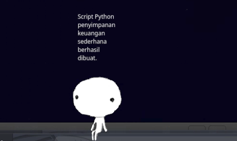
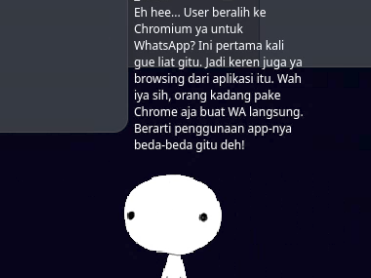

# Lumina AI

> A local AI desktop companion with memory, tools, and desktop awareness.  
> **Powered by Alibaba's Qwen** - Advanced open-source language models for intelligent interaction.

<p align="center">
  
</p>

<p align="center">
<strong>🤖 Powered by Alibaba Cloud's Qwen | 🏠 100% Local Processing | 🔒 Privacy-First</strong>
</p>


Lumina AI is an AI-powered desktop companion built with native C++ and Qt6 on top of the Shijima framework. Unlike traditional desktop mascots, Lumina can remember conversations, browse the web, manipulate files, execute commands, monitor active windows, and interact with the user's desktop environment through a persistent animated companion powered by **Alibaba's Qwen** language models running locally.

## Current Capabilities

* Chat with local LLMs through Ollama
* Maintain conversation memory
* Search, read, create, and modify files
* Execute shell commands
* Browse websites and retrieve information
* Detect and react to active windows
* Expose functionality through HTTP APIs
* Display dynamic mascot expressions and behaviors
* Voice interaction support via local speech-to-text and AI-driven responses

## Features

* Native C++ / Qt6 architecture
* Local LLM integration through Ollama
* Persistent memory subsystem
* Desktop awareness framework
* HTTP API integration
* Extensible tool architecture
* Animated mascot engine
* Linux desktop support

## Why Lumina?

Most desktop mascots are purely cosmetic.

Lumina combines an animated desktop companion with AI agent capabilities powered by **Alibaba's Qwen**, allowing it to understand context, remember information, interact with files, browse the web, execute commands, and respond to the user's desktop activity.

### 🌟 Why Qwen?

**Qwen** by Alibaba Cloud is one of the most advanced open-source language model families, offering:

- **Exceptional Performance**: Qwen models consistently rank among top open-source LLMs in benchmarks
- **Multilingual Support**: Native understanding of multiple languages with superior translation capabilities
- **Advanced Reasoning**: Strong mathematical, logical, and code generation abilities
- **Efficient Architecture**: Optimized for both speed and accuracy on consumer hardware
- **Open Source**: Fully transparent and auditable, respecting user privacy and freedom
- **Active Development**: Continuously improved by Alibaba's DAMO Academy research team

Lumina leverages Qwen's capabilities to provide intelligent, context-aware desktop assistance while keeping all processing local to your machine.

## Goals

Lumina AI aims to bridge the gap between traditional desktop mascots and modern AI assistants by combining an interactive animated companion with practical desktop automation and AI capabilities.

## Technology Stack

* **C++17** - High-performance native code
* **Qt6** - Modern cross-platform GUI framework
* **Ollama** - Local LLM inference engine
* **Alibaba Qwen** - Advanced open-source language models
* **HTTP-based Tool System** - Flexible agent architecture
* **Shijima Framework** - Desktop mascot rendering engine
* **Whisper.cpp** - Optimized speech-to-text processing

## Ollama Setup

Lumina AI requires a local Ollama instance and at least one compatible language model.
> ⚠️ **Recommended**: Current releases are optimized for `qwen2.5:3b` from **Alibaba's Qwen** family, running through Ollama.
> 
> 💡 **Why Qwen?** Qwen models offer exceptional performance-to-size ratio, making them perfect for local deployment while maintaining high-quality responses.

### Install Ollama

```bash
curl -fsSL https://ollama.com/install.sh | sh
```

Verify installation:

```bash
ollama --version
```

### Download a Model

Lumina AI is currently configured and optimized for **Alibaba's Qwen** family:

```bash
ollama pull qwen2.5:3b
```

**Alternative Qwen Models** (if you have more VRAM):
```bash
# For better accuracy with more resources
ollama pull qwen2.5:7b
# For maximum performance on powerful hardware
ollama pull qwen2.5:14b
```

You can verify the model is installed:

```bash
ollama list
```

### Start Ollama

```bash
sudo systemctl start ollama
```

Or run manually:

```bash
ollama serve
```

Make sure the Ollama API is accessible at:

```text
http://localhost:11434
```


## Requirements

- **OS**: Linux (tested on Debian-based distributions)
- **Qt6**: Development Libraries
- **Compiler**: C++ Compiler with C++17 support
- **AI Backend**: Ollama
- **Recommended Model**: Alibaba Qwen 2.5 (3B/7B/14B)
- **Utilities**: xdotool for desktop interaction
- **Optional**: NVIDIA GPU for faster inference (CUDA support via Ollama)

## Installation

```bash
# 0. Install xdotool
sudo apt install xdotool
# 1. Clone repository utama + download semua nested submodule secara paralel sekaligus
git clone --recursive -j$(nproc) https://github.com/Lumina403/LUMINA-AI.git
cd LUMINA-AI

# 2. Pastikan internal submodule tracking lu sinkron sama GitHub fork lu
git submodule sync --recursive
git submodule update --init --recursive --force

# 3. Trik Koboi: Generate paksa Qt6 Meta-Object (MOC) manual biar Makefile kagak balapan thread
/usr/lib/qt6/libexec/moc ShijimaManager.hpp -o ShijimaManager.moc

# 4. Pastikan backend AI (Ollama) lu udah nyala di latar belakang
sudo systemctl start ollama

# 5. Bantai kompilasi pake full power semua core CPU lu!
CONFIG=release make -j$(nproc)

# 6. Set environment path jeroan library, terus RUNNING JAHANAM!
export LD_LIBRARY_PATH=$LD_LIBRARY_PATH:$(pwd)
./shijima-qt
```
## Screenshots

### Chat Interface


### File Operations


### Desktop Awareness


## Credits

Lumina AI is built on top of the Shijima-Qt framework and extends it with AI-powered desktop interaction, memory systems, tool execution, automation, web browsing, and local LLM integration.

### 🤖 AI Model

- **Alibaba Qwen** - Advanced open-source language models by Alibaba Cloud's DAMO Academy
  - Qwen2.5 series: Exceptional performance for local deployment
  - Multilingual support and advanced reasoning capabilities
  - Open weights with permissive licensing

### 🔧 Core Technologies

- **Shijima-Qt** - Desktop mascot rendering framework
- **libshimejifinder** - Mascot data discovery and loading
- **Qt6** - Cross-platform application framework
- **Ollama** - Local LLM inference engine
- **Whisper.cpp** - Efficient speech-to-text processing

Special thanks to the original Shijima-Qt and libshimejifinder contributors for providing the foundation that made this project possible.

AI architecture, agent systems, integrations, and additional functionality developed by Azkiah Darojah.

## License

Lumina AI is licensed under the GNU General Public License v3.0 (GPL-3.0).

As Lumina AI incorporates and extends GPL-licensed software from the Shijima-Qt ecosystem, all redistributed versions and derivative works must comply with the GPL-3.0 license terms.

## Project Status

Lumina AI is currently under active development. Features, APIs, and agent capabilities may change between releases.

## Roadmap
- [x] Local LLM integration
- [x] Memory system
- [x] File operations
- [x] Desktop awareness
- [x] Command execution
- [x] Web browsing
- [ ] Multi-model support
- [x] Voice interaction
- [ ] Improved agent autonomy
- [ ] Additional desktop integrations

## Architecture

Lumina AI consists of three primary layers:

- **Mascot Layer** (Shijima-based rendering and interactions)
- **Agent Layer** (memory, reasoning, and tool orchestration powered by Alibaba Qwen)
- **Integration Layer** (file operations, web access, command execution, and desktop awareness)

All AI inference is performed locally through Ollama-compatible language models, with **Alibaba's Qwen** being the recommended model family for optimal performance and accuracy.

```
┌─────────────────────────────────────────────────┐
│              User Interface (Qt6)               │
├─────────────────────────────────────────────────┤
│           Mascot Engine (Shijima)               │
├─────────────────────────────────────────────────┤
│         AI Agent (Qwen via Ollama)              │
│  ┌─────────────┬─────────────┬──────────────┐   │
│  │   Memory    │    Tools    │  Reasoning   │   │
│  └─────────────┴─────────────┴──────────────┘   │
├─────────────────────────────────────────────────┤
│        Desktop Integration Layer                │
│  ┌─────────────┬─────────────┬──────────────┐   │
│  │   Files     │    Web      │   Commands   │   │
│  └─────────────┴─────────────┴──────────────┘   │
└─────────────────────────────────────────────────┘
```

---

<p align="center">
<strong>Made with ❤️ using Alibaba Qwen | Local AI for Everyone</strong>
</p>
